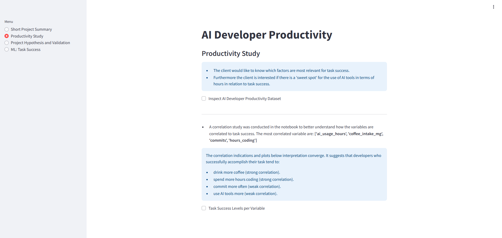
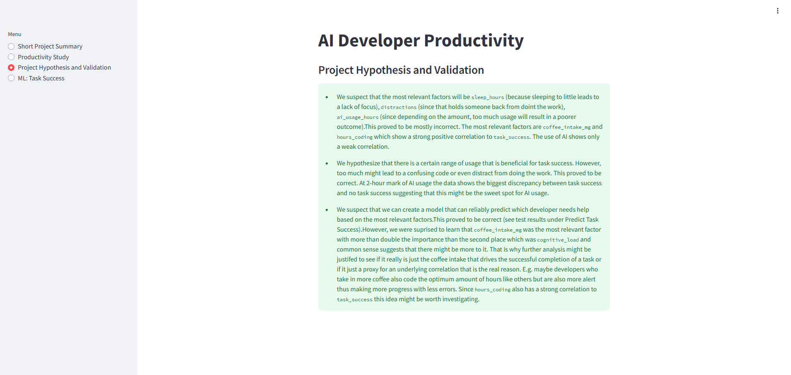
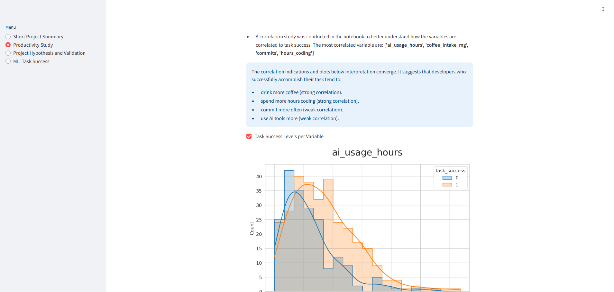

# Portfolio Project 5

## Introduction: A write-up of the CRISP-DM workflow and how it was used to create this project

### Business Understanding

A clear business case was outlined and business requirements were formulated so that everyone involved knows what the objective was. To even deepen the understanding of the data and the objective and how to reach it, several hypotheses were stated as well as how to validate them and a rationale to map the business requirements to the Data Visualizations and ML tasks  
See 'Business Requirements' section.  
See 'Hypothesis and how to validate' section.  
See 'The rationale to map the business requirements to the Data Visualizations and ML tasks' section.

### Data Understanding

For a better understanding of the dataset it was described as well as the terms and jargon used.  
See 'Dataset Content' section.  
See 'Terms and Jargon' section.

### Data Preparation

The data was cleaned and feature engineered to make it more suitable for the machine learning process.  
See 'Data Cleaning and Feature Engineering' in the 'ML Business Case' section.

### Modelling

A suitable model was choosen as well as a success metric and other information regarding the model, its inputs and outputs.  
See 'Classification Model' in the 'ML Business Case' section.

### Evaluation

An evaluation of the results were done with statements of whether or not the business requirements were met.  
See 'Page 4: Project Hypothesis and Validation' of the 'Dashboard Design' section.  

### Deployment

The streamlit app was successfully deployed locally and on heroku.
See 'Deployment' section.

## Dataset Content

The dataset contains information about AI developers over 500 days capturing eight variables that correlate with successfully accomplishing a set task trying to understand what drives productivity for AI developers.  
It contains the following variables:

| Variable | Meaning | Unit |
| :-----: | :----- | :-----|
| hours_coding | Total focused hours spent on software development work (0–12 hours) | 0–12 hours |
| coffee_intake_mg | Daily caffeine intake in milligrams | 0–600 mg |
| distractions | Number of distractions (e.g., meetings, Slack notifications) | 0–10 |
| sleep_hours | Number of hours of sleep the previous night | 3–10 hours |
| commits | Number of code commits pushed during the day | 0–20 |
| bugs_reported | Number of bugs reported in code written that day | 0–10 |
| ai_usage_hours | Number of hours spent using AI tools  | 0–12 |
| cognitive_load | Self-reported mental strain | a scale of 1 to 10 |
| task_success | Whether the daily productivity goal was achieved | 0 or 1 where 0 = no and 1 = yes |

## Terms and Jargon

* Examples for AI tools: ChatGPT, Copilot

## Business Requirements

1. The client would like to know which factors are most relevant for task success.
2. Furthermore the client is interested if there is a "sweet spot" for the use of AI tools in terms of hours in relation to task success.
3. The client would like to have a model to predict whether or not a developer is likely to not succeed based on the most relevant factors.

## Hypothesis and how to validate

* We suspect that the most relevant factors will be sleep_hours (because sleeping to little leads to a lack of focus), distractions (since that holds someone back from doint the work), ai_usage (since depending on the amount, too much usage will result in a poorer outcome).
  * We will conduct a correlation study.
* We hypothesize that there is a certain range of usage that is beneficial for task success. However, too much might lead to a confusing code or even distract from doing the work.
  * The results from the study mentioned above should give us the necessary insights.
* We suspect that we can create a model that can reliably predict which developer needs help based on the most relevant factors.
  * After finding the most relevant factors will train and test model.

## The rationale to map the business requirements to the Data Visualizations and ML tasks

* Business Requirement 1: Correlation study with data visualization
  * We will inspect the data related to the productivity of AI developers.
  * We will conduct a correlation study (Pearson and Spearman) to understand better how the variables are correlated to `task_success`.
  * We will search for the four top correlated variables
  * We will plot the main variables against `task_success` to visualize insights.

* Business Requirement 2: Correlation study with data visualization
  * In the correlation study we will also answer the question if there is a certain amount of AI tools usage that is beneficial to productivity measured in successfully completing a task and what this amount is.

* Business Requirement 3: Predicting task success
  * We want to predict if a developer will succeed in task completion.
  * For that We want to build a binary classifier that uses the most relevant variables from the dataset.

## ML Business Case

### Predict Task Success

#### Data Cleaning and Feature Engineering

* No missing data are in the dataset. No categorical variables are in the dataset. In that regard no data cleaning will to be done.
* Different approaches will be used to feature engineer potential variables for better use in the model training.

#### Classification Model

* We want an ML model to predict if a developer will succeed in task completion based on the dataset. The target variable is numerical. We consider a classification model with the outcome of: 0 (no task success) and 1 (task success)
* Our ideal outcome is to provide the client with insights on where they can help their developers with task completion.
* The model success metrics are
  * at least 80% Recall for no task success, on train and test set
* The model output is defined as a flag, indicating if a developer will succeed in task completion or not and the associated probability of not succeeding.
* Heuristics: Currently, there is no approach to task success.
* The training data to fit the model comes from a dataset containing records of 500 days of AI developers.
  * Train data - target: `task_success`; features: all other variables.

## Dashboard Design

* Later, during the project development, you may revisit your dashboard plan to update a given feature (for example, at the beginning of the project you were confident you would use a given plot to display an insight but subsequently you used another plot type).

### Page 1: Short project summary

Project Terms & Jargon
Describe Project Dataset
State Business Requirements

### Page 2: Productivity Study

Before the analysis, we knew we wanted this page to answer business requirement 1 and 2, but we couldn't know in advance which plots would need to be displayed.
After data analysis, we agreed with stakeholders that the page will:
State business requirement 1
State business requirement 2
Checkbox: data inspection on AI developer dataset (display the number of rows and columns in the data, and display the first ten rows of the data)
Display the most correlated variables to task_success and the conclusions
Checkbox: Individual plots showing the task_success levels for each correlated variable

### Page 4: Project Hypothesis and Validation

Before the analysis, we knew we wanted this page to describe each project hypothesis, the conclusions, and how we validated each. After the data analysis, we can report that:

* We suspect that the most relevant factors will be `sleep_hours`
(because sleeping to little leads to a lack of focus), `distractions`
(since that holds someone back from doint the work), `ai_usage_hours`
(since depending on the amount, too much usage will result in a
poorer outcome).
This proved to be mostly incorrect. The most relevant factors are
`caffeine_intake_mg` and `hours_coding` which show a strong positive
correlation to `task_success`. The use of AI shows only a weak
correlation."

* We hypothesize that there is a certain range of usage that is
beneficial for task success. However, too much might lead to a
confusing code or even distract from doing the work.
This proved to be correct. At 2-hour mark of AI usage the data shows
the biggest discrepancy between task success and no task success
suggesting that this might be the sweet spot for AI usage.

* We suspect that we can create a model that can reliably predict which developer needs help based on the most relevant factors. This proved to be correct (see test results under Predict Task Success). However, we were suprised to learn that `coffee_intake_mg` was the most relevant factor with more than double the importance than the second place which was `cognitive_load` and common sense suggests that there might be more to it. That is why further analysis might be justifed to see if it really is just the coffee intake that drives the successful completion of a task or if it just a proxy for an underlying correlation that is the real reason. E.g. maybe developers who take in more coffee also code the optimum amount of hours like others but are also more alert thus making more progress with less errors. Since `hours_coding` also has a strong correlation to `task_success` this idea might be worth investigating."

### Page 5: Predict Task Success

State business requirement 3.

Considerations and conclusions after the pipeline is trained
Present ML pipeline steps
Feature importance
Pipeline performance

## Testing and Bugs

### Manual Testing

| Start                | Feature             | User Action | Outcome | Test Result | Image             |
| :------------------: | :------------------ | :---------: | :------ | :---------: | :---------------: |
| all pages | Menu on the sidebar | Click on any of the pages | That page is displayed | passed |     |
| page_productivity_study.py | Checkbox before 'Inspect AI Developer Productivity Dataset' | Check or un-check checkbox | The first ten rows of the dataset are displayed or collapsed, respectively | passed |   |
| page_productivity_study.py | Checkbox before 'Task Success Levels per Variable' | Check or un-check checkbox | The feature importance plots are displayed or collapsed, respectively | passed |  |

### Unfixed Bugs

* I was not able to fix the 'FutureWarning' when I ran a code cell that used the ppscore package in the 'DataCleaning' notebook. The message was:  
  "/home/cistudent/.local/lib/python3.12/site-packages/ppscore/calculation.py:201: FutureWarning: is_categorical_dtype is deprecated and will be removed in a future version. Use isinstance(dtype CategoricalDtype) instead or is_categorical_dtype(series)".  
  If I updated ppscore it caused a compatibility error with pandas since it needed pandas<2.0.0,>= 1.0.0. However, downgrading pandas was also not a good option since when ydata-profiling called visions it needed pandas>=2.0.0. Downgrading visions to version 0.7.5 was compatible with the pandas<2.0.0 but then in turn incompatible for the purposes it was called by ydata-profiling.  
  So in short: Either ppscore would not work or ydata-profiling (or better visions) depending on the pandas version. So I decided, since it was 'only' a future warning and not error to hide it from view.

## Deployment

### Locally

1. Log into your GitHub account
2. Fork this repo.
3. In your forked repo click on the green Code button.
4. Click on the 'Codespaces' tab
5. Click Create codespace on main.
6. Wait for the workspace to open.
7. Open a new terminal
8. In the terminal type 'pip3 install -r requirements.txt' and press enter to install all the requirements
9. Click the kernel button and choose Python Environments.
10. In the terminal type 'streamlit run app.py' and press enter
11. In the pop-up window in the bottom-right corner click on 'Open in browser'.

Note: Choose the kernel Python 3.12.1 as it inherits from the workspace, so it will be Python-3.12.1 as installed by Codespaces. To confirm this, you can use ! python --version in a notebook code cell.

### Heroku

* The App live link is: [PP5](https://ai-developer-productivity-84f8052b1212.herokuapp.com/)

* The project was deployed to Heroku using the following steps.

1. Log into your Heroku account
2. Click on 'New' in the upper right-hand corner.
3. From the dropdown menu select 'Create new app'.
4. Give the app a name of your choosing.
5. Choose your location.
6. (Don't add to pipeline.)
7. Click on the 'Deploy'-tab.
8. Under 'Deployment Method' choose 'GitHub'.
9. Search for your copy of the repository and choose it.
10. Click on 'Deploy Branch' and wait until the built is done.
11. At the Deploy tab, select GitHub as the deployment method.
12. Select your repository name and click Search. Once it is found, click Connect.
13. Select the branch you want to deploy, then click Deploy Branch.
14. Click now the button Open App on the top of the page to access your App.

Note: If the slug size is too large then add large files not required for the app to the .slugignore file.

## Main Data Analysis and Machine Learning Libraries

For a complete list of all the libraries that were used for the project please read the 'requirements-dev.txt' file.

Example for use cases:
* The packages 'pandas', 'matplotlib', 'seaborn' and 'plotly' were used to create the plots.
* The package 'streamlit' was used to run the streamlit app.
* The package 'xgboost' contained one of the algorithms that was test in the ML business case.

## Credits 

* In this section, you need to reference where you got your content, media and extra help from. It is common practice to use code from other repositories and tutorials, however, it is important to be very specific about these sources to avoid plagiarism. 
* You can break the credits section up into Content and Media, depending on what you have included in your project. 

### Content 

- The text for the Home page was taken from Wikipedia Article A
- Instructions on how to implement form validation on the Sign-Up page were taken from [Specific YouTube Tutorial](https://www.youtube.com/)
- The icons in the footer were taken from [Font Awesome](https://fontawesome.com/)

### Media

- The photos used on the home and sign-up page are from This Open-Source site
- The images used for the gallery page were taken from this other open-source site

## Acknowledgements (optional)
* Thank the people who provided support through this project.

